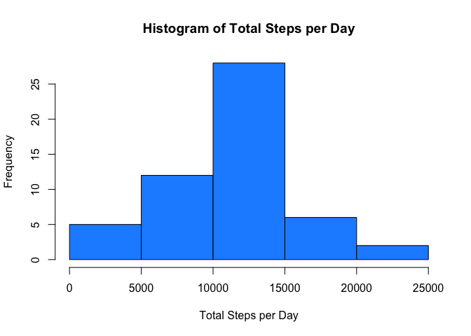
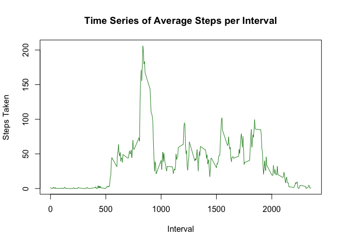
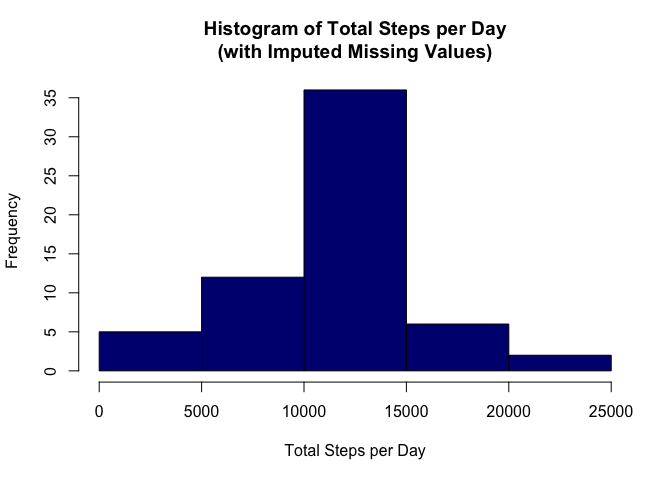
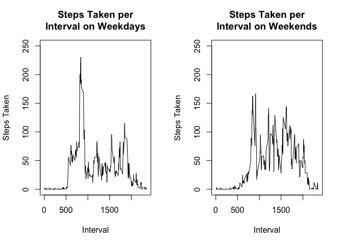

## Loading and preprocessing the data

Note that the CSV file of the dataset must be in the user's current working directory in order for the following lines of code to run correctly.


```r
activity = read.csv('activity.csv')
activity$date = as.Date(activity$date)
```

## What is mean total number of steps taken per day?

To calculate the total number of steps taken per day, the 'aggregate' function can be used to get the sum of steps grouped by date.


```r
steps_per_day = aggregate(steps ~ date, activity, sum, na.rm = TRUE)
```

The following code displays a histogram of the total number of steps taken each day.


```r
hist(steps_per_day$steps,
     xlab = 'Total Steps per Day',
     main='Histogram of Total Steps per Day',
     col='dodgerblue')
```

<!-- -->

To get the mean and median of the total number of steps taken per day, we can use the 'summarise' function included in the *dplyr* package.


```r
library(dplyr)
steps_summary = summarise(steps_per_day,
                          mean_steps = mean(steps_per_day$steps),
                          median_steps = median(steps_per_day$steps))
steps_summary
```

```
##   mean_steps median_steps
## 1   10766.19        10765
```

The mean total number of steps taken per day is **10766.19**, while the median number of steps taken per day is **10765**.

## What is the average daily activity pattern?

To calculate the total number of steps taken per interval, the 'aggregate' function can once again be used to get the average steps across all days grouped by interval.


```r
steps_per_interval = aggregate(steps ~ interval, activity, mean, na.rm = TRUE)
```

The following code then displays the time series plot of the average daily activity.


```r
plot(steps_per_interval$interval,steps_per_interval$steps,
     type='l',xlab='Interval',ylab='Steps Taken',
     main='Time Series of Average Steps per Interval',col='forestgreen')
```

<!-- -->

To get the 5-minute interval that contains the maximum number of steps, we run the following code.


```r
max_interval = steps_per_interval[which(steps_per_interval$steps==max(steps_per_interval$steps)),]
max_interval$interval
```

```
## [1] 835
```

The 5-minute interval that contains the maximum number of steps is **835**.

## Imputing missing values

To fill in all of the missing values in the dataset, the strategy utilized was to use the mean for the missing values' corresponding 5-minute interval.


```r
activity_imputed = activity

for (i in 1:nrow(activity_imputed)) {
    if (is.na(activity_imputed[i,'steps']) == TRUE) {
        activity_imputed[i,'steps'] = steps_per_interval[which(steps_per_interval$interval==activity_imputed[i,'interval']),'steps']
    }
}
```

The following code then displays a histogram of the total number of steps taken each day, using the new dataset with the missing data filled in.


```r
imputed_steps = aggregate(steps ~ date, activity_imputed, sum, na.rm = TRUE)

hist(imputed_steps$steps,
     xlab = 'Total Steps per Day',
     main='Histogram of Total Steps per Day\n(with Imputed Missing Values)',
     col='navy')
```

<!-- -->

To get the mean and median of the total number of steps taken per day of the new dataset, we can use the 'summarise' function included in the *dplyr* package.


```r
library(dplyr)
imputed_steps_summary = summarise(imputed_steps,
                          mean_imputed_steps = mean(imputed_steps$steps),
                          median_imputed_steps = median(imputed_steps$steps))
imputed_steps_summary
```

```
##   mean_imputed_steps median_imputed_steps
## 1           10766.19             10766.19
```
Both the mean and median total number of steps taken per day of the dataset with the missing data imputed are equal to **10766.19**. Interestingly, these mean and median values are very similar to the estimates calculated for the original dataset due to the use of the 'mean' function when imputing the NA data.

However, based on the histogram generated, a noticeable impact is the considerable increase in the frequency of values (i.e., from a max of around 25 to around 35) which is expected as missing values were imputed.

## Are there differences in activity patterns between weekdays and weekends?

Using the combination of the 'ifelse' and 'weekdays' functions, the following code creates a new variable which indicates if the date was a weekday or weekend. The dataset is then split into weekday and weekend data in order to calculate the average steps taken per day for each set.


```r
activity_imputed$day_level = ifelse(weekdays(activity_imputed$date) %in% list('Saturday','Sunday'), 'Weekend','Weekday')

weekday_activity = activity_imputed[which(activity_imputed$day_level == 'Weekday'),]
weekend_activity = activity_imputed[which(activity_imputed$day_level == 'Weekend'),]

weekday_steps = aggregate(steps ~ interval, weekday_activity, mean)
weekend_steps = aggregate(steps ~ interval, weekend_activity, mean)
```

Finally, the panel plot is created which shows the average steps taken per 5-minute interval, for both weekdays and weekends.


```r
par(mfrow=c(1,2))
plot(weekday_steps$interval,weekday_steps$steps,
     type='l',xlab='Interval',ylab='Steps Taken',
     main='Steps Taken per\nInterval on Weekdays',ylim=c(0,250))
plot(weekend_steps$interval,weekend_steps$steps,
     type='l',xlab='Interval',ylab='Steps Taken',
     main='Steps Taken per\nInterval on Weekends',ylim=c(0,250))
```

<!-- -->
